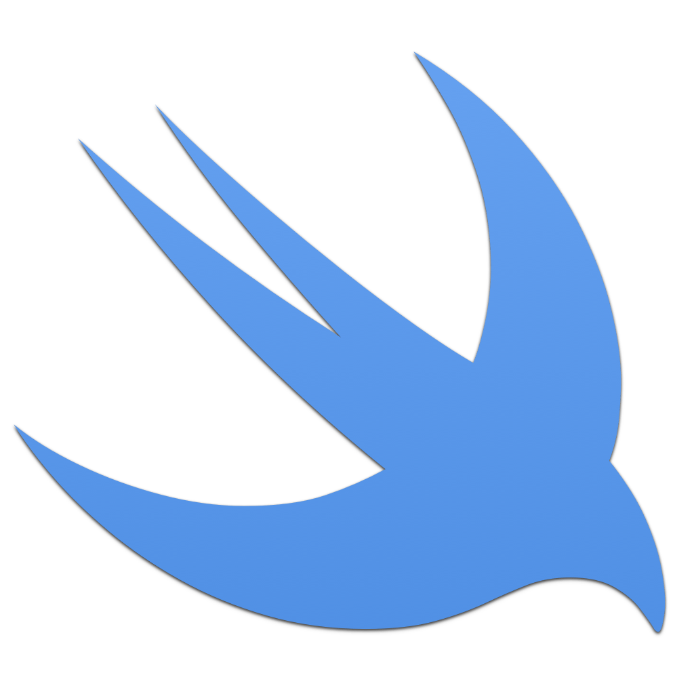

<p align="center">
    
</p>

<p align="center">
    
    
    
    <a href="https://danielsaidi.github.io/SwiftUIKit"></a>
    
</p>


# SwiftUIKit

SwiftUIKit is a Swift SDK that adds extra functionality to `SwiftUI` and `Swift`. It contains additional components, a lot of extensions to native types, and much more. 

SwiftUIKit can kickstart your development and solves many tricky problems.


## Installation

SwiftUIKit can be installed with the Swift Package Manager:

```
https://github.com/danielsaidi/SwiftUIKit.git
```


## Getting Started

SwiftUIKit started small, but has grown big over the years. Due to its complexity, I decided to remove the demo. Instead, have a look at the various namespaces and use the live previews to explore the SDK.

I will extract parts of this project into separate libraries, to provide better documentation & help. Have a look at [my open-source listing page][OpenSource] for some of these.


## Documentation

The [online documentation][Documentation] has more information, code examples, etc.


## Support my work 

You can [sponsor me][Sponsors] on GitHub Sponsors or [reach out][Email] for paid support, to help support my [open-source projects][OpenSource].

Your support makes it possible for me to put more work into these projects and make them the best they can be.


## Contact

Feel free to reach out if you have questions, or want to contribute in any way:

* Website: [danielsaidi.com][Website]
* E-mail: [daniel.saidi@gmail.com][Email]
* Bluesky: [@danielsaidi@bsky.social][Bluesky]
* Mastodon: [@danielsaidi@mastodon.social][Mastodon]


## License

SwiftUIKit is available under the MIT license. See the [LICENSE][License] file for more info.


[Email]: mailto:daniel.saidi@gmail.com
[Website]: https://danielsaidi.com
[GitHub]: https://github.com/danielsaidi
[OpenSource]: https://danielsaidi.com/opensource
[Sponsors]: https://github.com/sponsors/danielsaidi

[Bluesky]: https://bsky.app/profile/danielsaidi.bsky.social
[Mastodon]: https://mastodon.social/@danielsaidi
[Twitter]: https://twitter.com/danielsaidi

[Documentation]: https://danielsaidi.github.io/SwiftUIKit
[License]: https://github.com/danielsaidi/SwiftUIKit/blob/master/LICENSE
